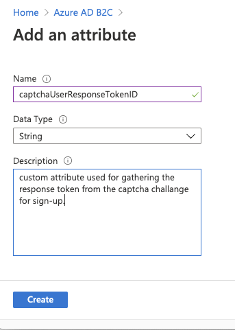
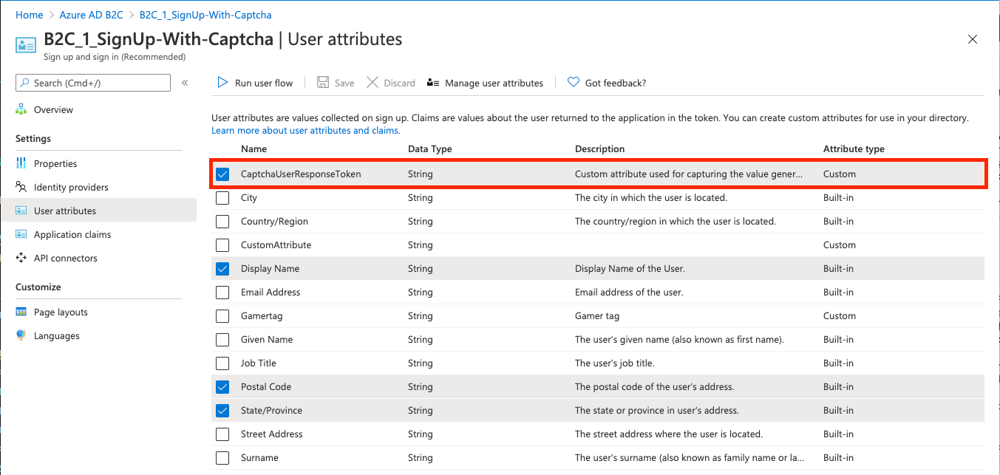
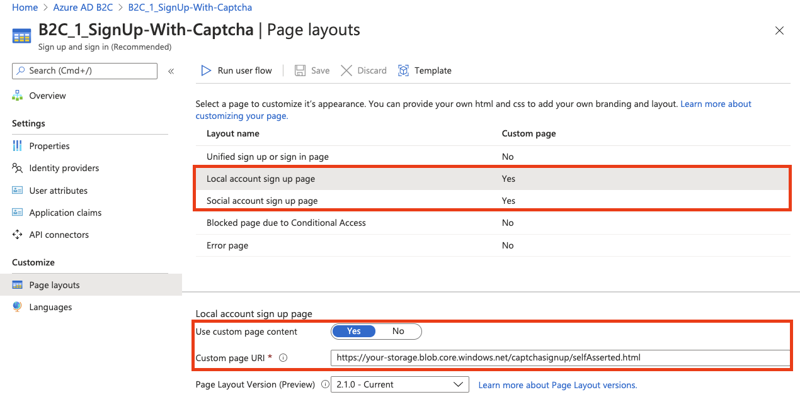
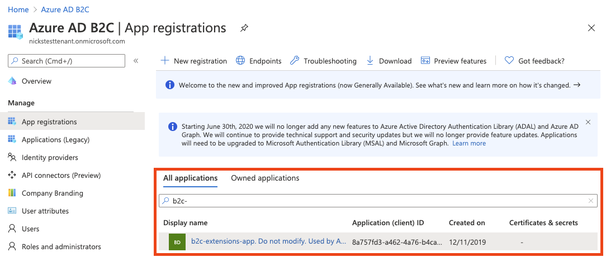
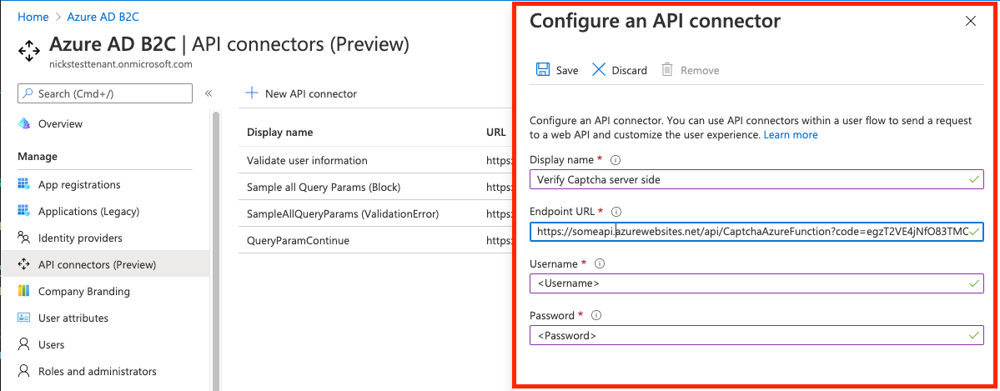
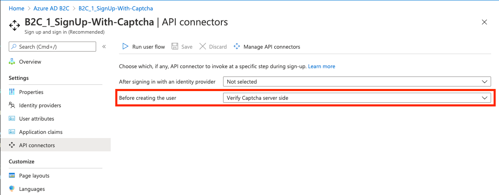

# active-directory-node-b2c-user-flow-captcha

## Contents

| File/folder                 | Description                                |
| --------------------------- | ------------------------------------------ |
| Assets/selfAsserted.html      | Sample custom HTML and JS script file for user flow.     |
| Assets     | Contains UI/UX assets used by the user flows.    |
| CaptchaAzureFunction(AzureFunction.cs)      | Sample source code for Node.js HTTP trigger.    |
| `README.md`                 | This README file.                          |
| `.gitignore`                | Define what to ignore at commit time.      |
| `CONTRIBUTING.md`                   | Guidance on how to contribute to this repository.        |
| `LICENSE.md`                   | The license for the sample.                |
| `SECURITY.md`                   | The security notice for the sample.      |

## Key Concepts

CAPTCHA services are often used in authentication scenarios to protect against bots or other automated abuse. This sample demonstrates how to integrate an Azure AD B2C sign-up user flow with a CAPTCHA service.

Key components:

- [**reCAPTCHA**](https://developers.google.com/recaptcha/) - a CAPTCHA service for protecting against bots and other automated abuse.
- **Azure AD B2C sign-up user flow** - The sign-up experience that will be using the CAPTCHA service. Will utilize the [custom HTML & JavaScript](https://docs.microsoft.com/azure/active-directory-b2c/customize-ui-overview) and [API connectors](https://docs.microsoft.com/azure/active-directory-b2c/api-connectors-overview) to integrate with the CAPTCHA service.
- **Azure Functions** - API endpoint hosted by you that works in conjunction with the **API connectors** feature. This API is responsible for doing the server-side validation of the CAPTCHA challenge.

This same pattern can be used for other CAPTCHA services and with other API hosting services.

## Create an API key pair for reCAPTCHA V2

- Follow the [reCAPTCHA documentation](https://developers.google.com/recaptcha/intro) to create an API key pair for your scenario.
- Use your Azure AD B2C tenant as the **domain**: `<tenantname>.b2clogin.com`
- You will receive a **site_key** and **secret_key**. The values of these are referred to as **`CAPTCHA_SITE_KEY`** and **`CAPTCHA_SECRET_KEY`** in the sample code and correspond to keys used in client-side and server-side CAPTCHA API calls.

## Create a "CaptchaUserResponseToken" Custom Attribute

1. From the Azure Portal, go to **Azure AD B2C**
1. Select **User Attributes**
1. Select **Add**
1. Enter `CaptchaUserResponseToken` as the attribute **Name**
1. **Create**



Learn more about [custom attributes](https://docs.microsoft.com/azure/active-directory-b2c/user-flow-custom-attributes).

## Create a user flow

This can be either be a **sign up and sign in** or a just **sign up** or user flow. Either way, the CAPTCHA will only be shown during sign up.

1. [Follow these instructions](https://docs.microsoft.com/azure/active-directory-b2c/tutorial-create-user-flows). If using an existing user flow, note that user flows must be of the "Recommended (next-generation preview)" version type.
1. In the user flow settings, navigate to **User attributes** and select the **CaptchaUserResponseToken** claim.



## Configure custom HTML, JavaScript, and Page Layouts

The **Assets > selfAsserted.html** file contains an HTML template with JavaScript (`<script>` tags) that will do three things:

- Load the reCAPTCHA script (`https://www.google.com/recaptcha/api.js`), which renders the reCAPTCHA widget and performs client-side CAPTCHA validation.
- Hide the `extension_CaptchaUserResponseToken` input element and label, corresponding to the CaptchaUserResponseToken custom attribute, from the UI shown to the user.
- When a user completes the CAPTCHA challenge, reCAPTCHA verifies the user's response and generates a token. When this happens, the callback `captchaCallback` in the custom JavaScript sets the value of **extension_CaptchaUserResponseToken** to the generated token value. This value will be submitted to the API endpoint as described in the "Create and deploy your API" section.

Read more about reCAPTCHA V2 checkbox client-side validation [here](https://developers.google.com/recaptcha/docs/display).

Follow the instructions below to use this custom HTML and JS for your user flow.

### Modify the selfAsserted.html page

Modify the **Assets > selfAsserted.html** file so that `<CAPTCHA_SITE_KEY>` matches the value you generated in the first step, which is used by the reCAPTCHA script.

### Host the HTML page

Host the html page on a CORS enabled web endpoint. For example, follow **steps 2 and 3** of [these](https://docs.microsoft.com/en-us/azure/active-directory-b2c/customize-ui-with-html?pivots=b2c-user-flow#2-create-an-azure-blob-storage-account) instructions ("Create an Azure Blob storage account" and "Configure CORS").

If you have your own custom HTML, just copy and paste the `<script>` elements onto your HTML page.

### Configure page layouts

1. From the Azure Portal, go to **Azure AD B2C**
1. Navigate to **User flows** and select your user flow
1. Select **Page layouts**
1. Select **Local account sign up page** layout
1. Toggle **Use custom page content** to "YES"
1. Paste the URI where your custom HTML lives in **Use custom page content**
1. Do the previous two steps for **Social account sign up page** layout if using social identity providers.



### Enable JavaScript

1. From your user flow, go to **Properties** and select **Enable JavaScript enforcing page layout (preview)**

Learn more [here](https://docs.microsoft.com/azure/active-directory-b2c/user-flow-javascript-overview).

## Create and deploy your API

These steps assume you use Visual Studio Code, but deploying the Azure Function via the Azure Portal, terminal or command prompt, or any other code editor will also work.

**Prerequisite**: Install the [Azure Functions extension](https://marketplace.visualstudio.com/items?itemName=ms-azuretools.vscode-azurefunctions) for Visual Studio Code.

### Run the API locally

1. Navigate to the **Azure extension** in Visual Studio code on the left navigation bar. You should see a 'Local Project' folder representing your local Azure Function.
1. Press **F5** (or use the **Debug > Start Debugging** menu command) to launch the debugger and attach to the Azure Functions host. (This command automatically uses the single debug configuration that Azure Functions created.)
1. The Azure Function extension will automatically generate a few files for local development, install dependencies, and install the Function Core tools if not already present. These tools help with the debugging experience.
1. Output from the Functions Core tools appears in the VS Code **Terminal** panel. Once the host has started, **Alt+click** the local URL shown in the output to open the browser and run the function. You can also see the url of the locally-hosted function by right clicking on the function on the Azure Functions explorer.
1. To redeploy the local instance during testing, just repeat these steps.

### Add environment variables

This sample protects the web API endpoint using [HTTP Basic authentication](https://tools.ietf.org/html/rfc7617).

Here, username and password are stored as environment variables so they're not stored as part of the repository. Read more about the [local.settings.json](https://docs.microsoft.com/azure/azure-functions/functions-run-local?tabs=macos%2Ccsharp%2Cbash#local-settings-file) file.

1. Create a **local.settings.json** file in your root folder
1. Copy and paste the below code onto the file:

```json
{
  "IsEncrypted": false,
  "Values": {
    "AzureWebJobsStorage": "",
    "FUNCTIONS_WORKER_RUNTIME": "node",
    "BASIC_AUTH_USERNAME": "<USERNAME>",
    "BASIC_AUTH_PASSWORD": "<PASSWORD>",
    "CAPTCHA_SECRET_KEY": "<CAPTCHA_SECRET_KEY>",
    "B2C_EXTENSIONS_APP_ID": "<B2C_EXTENSIONS_APP_ID>"
  }
}
```

The **BASIC_AUTH_USERNAME** and **BASIC_AUTH_PASSWORD** are going to be the credentials used to authenticate the API call to your Azure Function. Choose your desired values.

The `<CAPTCHA_SECRET_KEY>` is the server-side secret you generated in the reCAPTCHA service. It's used to call the [reCAPTCHA server-side validation API](https://developers.google.com/recaptcha/docs/verify) to validate the value of the `CaptchaUserResponseToken` generated by the front-end.

THE `<B2C_EXTENSIONS_APP_ID>` is the application ID of the app used by Azure AD B2C to store custom attributes in the directory. You can find this application ID by navigating to **App registrations**, searching for `b2c-extensions-app` and copying the `Application (client) ID` from the **Overview** pane. Remove the `-` characters.



### Deploy the application to the web

1. Follow steps of [this](https://docs.microsoft.com/azure/javascript/tutorial-vscode-serverless-node-04) guide #1-7 to deploy your Azure Function to the cloud. Copy the endpoint web URL of your Azure Function.
1. Once deployed, you'll see an **'Upload settings'** option. Select this. It will upload your environment variables onto the [Application settings](https://docs.microsoft.com/azure/azure-functions/functions-develop-vs-code?tabs=csharp#application-settings-in-azure) of the App service. These application settings can also be configured or [managed via the Azure portal](https://docs.microsoft.com/azure/azure-functions/functions-how-to-use-azure-function-app-settings).

To learn more about Visual Studio Code development for Azure Functions, see [this](https://docs.microsoft.com/azure/azure-functions/functions-develop-vs-code?tabs=csharp#republish-project-files).

## Configure and enable the API connector

Follow the steps outlined in ["Add an API connector"](https://docs.microsoft.com/azure/active-directory-b2c/add-api-connector) to create an API connector and enable it your user flow. The configuration should look like the below.

### API connector configuration

Your API connector configuration should look like the following:



- **Endpoint URL** is the Function URL you copied earlier if the deployed Azure Function.
- **Username** and **Password** are the Username and Passwords you defined as environment variables earlier.

### Enable the API connector

In the **API connector** settings for your user flow, select the API connector to be invoked at the **Before creating the user** step. This will invoke the API when a user hits 'Create' in the sign-up flow. The API will do a server-side validation of the `CaptchaUserResponseToken` value, which was is set when a user completed the captcha challenge during sign-up.



## Contributing

This project welcomes contributions and suggestions. Most contributions require you to agree to a
Contributor License Agreement (CLA) declaring that you have the right to, and actually do, grant us
the rights to use your contribution. For details, visit https://cla.opensource.microsoft.com.

When you submit a pull request, a CLA bot will automatically determine whether you need to provide
a CLA and decorate the PR appropriately (e.g., status check, comment). Simply follow the instructions
provided by the bot. You will only need to do this once across all repos using our CLA.

This project has adopted the [Microsoft Open Source Code of Conduct](https://opensource.microsoft.com/codeofconduct/).
For more information see the [Code of Conduct FAQ](https://opensource.microsoft.com/codeofconduct/faq/) or
contact [opencode@microsoft.com](mailto:opencode@microsoft.com) with any additional questions or comments.
